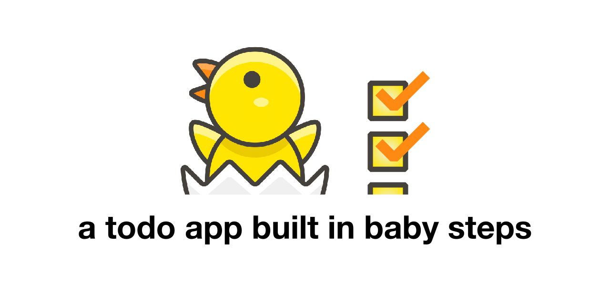

# Introduction

This is an educational _Vanilla JavaScript_ **todo application** that is built in babysteps.

_The idea is to offer an educational narrative and a process by which the learner can do the following:_
- attempt to code each babystep on their own first
- compare their code with the example code in the babystep (using the link _view babystep code_)
- come up with meaningful tests in the browser (using the link _preview babystep in the browser_) to ensure that the babystep implemented did work as expected

## Timelapse view

Click [this link](https://github.githistory.xyz/diraneyya/todo-app-in-babysteps/blob/main/index.html) to be able to travel through time and witness the evolution of this project. Unfortunately it starts at the last commit at the moment.
## Babystep 1
### Use boilerplate code to create an HTML page

> change the title of the HTML page to reflect the intent of
creating a todo application.

[View babystep code](https://github.com/diraneyya/todo-app-in-babysteps/commit/828cd05584ba29a61b236f0f8e894bba7399c3fc) |
[Preview babystep in browser](https://htmlpreview.github.io/?https://github.com/diraneyya/todo-app-in-babysteps/blob/828cd05584ba29a61b236f0f8e894bba7399c3fc/index.html) |
[Contribute test ideas](https://github.com/diraneyya/todo-app-in-babysteps/wiki/test1) |
[Contribute code ideas](https://github.com/diraneyya/todo-app-in-babysteps/wiki/code1)

## Babystep 2
## Add an unordered list to the HTML page

> use an Emmet abbreviation to insert 3 bullet points with dummy text (also called: lorem ipsum text) of 5 words each.

[View babystep code](https://github.com/diraneyya/todo-app-in-babysteps/commit/9fefb911392830875a9f384d60845ee611d7f388) |
[Preview babystep in browser](https://htmlpreview.github.io/?https://github.com/diraneyya/todo-app-in-babysteps/blob/9fefb911392830875a9f384d60845ee611d7f388/index.html) |
[Contribute test ideas](https://github.com/diraneyya/todo-app-in-babysteps/wiki/test2) |
[Contribute code ideas](https://github.com/diraneyya/todo-app-in-babysteps/wiki/code2)

## Babystep 3
## After the unordered list, add an inline script tag
    
> at this point, the script HTML tag is empty with no code in it yet. The script tag is mentioned right before the closing of the &lt;body&gt; tag.
    
> can you think of one reason why we want the script tag to come after the &lt;ul&gt; HTML tag?

[View babystep code](https://github.com/diraneyya/todo-app-in-babysteps/commit/3bd1e06d1d988b355575daef3c6b6ab1449bf528) |
[Preview babystep in browser](https://htmlpreview.github.io/?https://github.com/diraneyya/todo-app-in-babysteps/blob/3bd1e06d1d988b355575daef3c6b6ab1449bf528/index.html) |
[Contribute test ideas](https://github.com/diraneyya/todo-app-in-babysteps/wiki/test3) |
[Contribute code ideas](https://github.com/diraneyya/todo-app-in-babysteps/wiki/code3)

## Babystep 4
### Create a constant that refers to one list item
    
> using document.querySelector we can retrieve the DOM node object corresponding to the first unordered list item, being a node of type (i.e. tag name) of "li".

[View babystep code](https://github.com/diraneyya/todo-app-in-babysteps/commit/e1e6aefad7eb49dff35e30eaf0303945cc7f9902) |
[Preview babystep in browser](https://htmlpreview.github.io/?https://github.com/diraneyya/todo-app-in-babysteps/blob/e1e6aefad7eb49dff35e30eaf0303945cc7f9902/index.html) |
[Contribute test ideas](https://github.com/diraneyya/todo-app-in-babysteps/wiki/test4) |
[Contribute code ideas](https://github.com/diraneyya/todo-app-in-babysteps/wiki/code4)

## Babystep 5
### Add a click handler for the nodeItem DOM node
    
> using the onclick property and an empty function called
    "clickHandler", we are able to ask the browser to invoke this function each time the user clicks on the first list item in the document.

[View babystep code](https://github.com/diraneyya/todo-app-in-babysteps/commit/7091969ee51c46d78537ed684d6a525992af0de1) |
[Preview babystep in browser](https://htmlpreview.github.io/?https://github.com/diraneyya/todo-app-in-babysteps/blob/7091969ee51c46d78537ed684d6a525992af0de1/index.html) |
[Contribute test ideas](https://github.com/diraneyya/todo-app-in-babysteps/wiki/test5) |
[Contribute code ideas](https://github.com/diraneyya/todo-app-in-babysteps/wiki/code5)

## Babystep 6
### Add an argument to the click handler function
    
> when the browser calls an event handler, whether it is a click or any kind of handler, it also passes an argument.
    
> this argument contains the even object, which contains target and currentTarget properties.
    
> Use the debugger in the browser developer tools to peek into the argument and check both properties.

[View babystep code](https://github.com/diraneyya/todo-app-in-babysteps/commit/8811923ddec615acf40b4986debac07b143c3c50) |
[Preview babystep in browser](https://htmlpreview.github.io/?https://github.com/diraneyya/todo-app-in-babysteps/blob/8811923ddec615acf40b4986debac07b143c3c50/index.html) |
[Contribute test ideas](https://github.com/diraneyya/todo-app-in-babysteps/wiki/test6) |
[Contribute code ideas](https://github.com/diraneyya/todo-app-in-babysteps/wiki/code6)

## Babystep 7
### Logs event.target to the console
    
> use console.log with a single argument to log the target property of the event object to the console.

[View babystep code](https://github.com/diraneyya/todo-app-in-babysteps/commit/f7d35d0dc99adefc4befca135f98f696d46707ef) |
[Preview babystep in browser](https://htmlpreview.github.io/?https://github.com/diraneyya/todo-app-in-babysteps/blob/f7d35d0dc99adefc4befca135f98f696d46707ef/index.html) |
[Contribute test ideas](https://github.com/diraneyya/todo-app-in-babysteps/wiki/test7) |
[Contribute code ideas](https://github.com/diraneyya/todo-app-in-babysteps/wiki/code7)

## Babystep 8
### Make the console log clearer using a message
    
> instead of just logging the target property, use a string to indicate that what is being logged is the target property of the event object.
    
> this is done by passing multiple arguments to console.dir
    (check the syntax part of the MDN docs).

[View babystep code](https://github.com/diraneyya/todo-app-in-babysteps/commit/d6dfef8cb7814b7f3354b8185cc3e676c94397b6) |
[Preview babystep in browser](https://htmlpreview.github.io/?https://github.com/diraneyya/todo-app-in-babysteps/blob/d6dfef8cb7814b7f3354b8185cc3e676c94397b6/index.html) |
[Contribute test ideas](https://github.com/diraneyya/todo-app-in-babysteps/wiki/test8) |
[Contribute code ideas](https://github.com/diraneyya/todo-app-in-babysteps/wiki/code8)

## Babystep 9
### log the currentTarget property of the event object
    
> do the same with the currentTarget property of the event object as we did with the target property.
    
> now when the user clicks on the first list item in the page while the console is open, we are able to see the target and the currentTarget of the event which are passed to the event handler function by the browser.

[View babystep code](https://github.com/diraneyya/todo-app-in-babysteps/commit/5ed93676803fe331b020cb654067c23064a9db28) |
[Preview babystep in browser](https://htmlpreview.github.io/?https://github.com/diraneyya/todo-app-in-babysteps/blob/5ed93676803fe331b020cb654067c23064a9db28/index.html) |
[Contribute test ideas](https://github.com/diraneyya/todo-app-in-babysteps/wiki/test9) |
[Contribute code ideas](https://github.com/diraneyya/todo-app-in-babysteps/wiki/code9)

## Babystep 10
### Add few inline semantic tags to the list item
    
> inline semantic tags such as &lt;em&gt;, &lt;strong&gt; and &lt;abbr&gt; can be used to emphasize and elaborate on specific words and phrases within a paragraph or a list item.
    
> the fact these semantic tags apply to portions of the paragraph (one or more words) without effecting the entire paragraph means that they are inline tags or correspond to inline nodes in the document flow.
    
> these tags will allow us to test our click handler further and dig deeper into the difference between the target and the currentTarget properties of the event argument to the handler function.

[View babystep code](https://github.com/diraneyya/todo-app-in-babysteps/commit/2660d42b2390c29cb0e9819dd9619953d3e3cbc6) |
[Preview babystep in browser](https://htmlpreview.github.io/?https://github.com/diraneyya/todo-app-in-babysteps/blob/2660d42b2390c29cb0e9819dd9619953d3e3cbc6/index.html) |
[Contribute test ideas](https://github.com/diraneyya/todo-app-in-babysteps/wiki/test10) |
[Contribute code ideas](https://github.com/diraneyya/todo-app-in-babysteps/wiki/code10)

## Babystep 11
### define a constant inside the handler
    
> this constant refers to the list item clicked, which is stored in the currentTarget property of the event object.

[View babystep code](https://github.com/diraneyya/todo-app-in-babysteps/commit/5da623bc75876904e4d94e3b30a8a0d2b16027bf) |
[Preview babystep in browser](https://htmlpreview.github.io/?https://github.com/diraneyya/todo-app-in-babysteps/blob/5da623bc75876904e4d94e3b30a8a0d2b16027bf/index.html) |
[Contribute test ideas](https://github.com/diraneyya/todo-app-in-babysteps/wiki/test11) |
[Contribute code ideas](https://github.com/diraneyya/todo-app-in-babysteps/wiki/code11)

## Babystep 12
### Use the display CSS property to hide clicked item
    
> this is one way to remove a todo item when clicking it.
    
> in reality, the node still exists in the DOM but it is now hidden with no way to show it again.

[View babystep code](https://github.com/diraneyya/todo-app-in-babysteps/commit/f105c2403fda295f5f6bf6dc0a0a435a9cd58416) |
[Preview babystep in browser](https://htmlpreview.github.io/?https://github.com/diraneyya/todo-app-in-babysteps/blob/f105c2403fda295f5f6bf6dc0a0a435a9cd58416/index.html) |
[Contribute test ideas](https://github.com/diraneyya/todo-app-in-babysteps/wiki/test12) |
[Contribute code ideas](https://github.com/diraneyya/todo-app-in-babysteps/wiki/code12)

## Babystep 13
### Use the remove DOM function instead of display
    
> instead of using the display CSS property, one can actually remove the node from the DOM using the remove function.
    
> This is not supported in Internet Explorer but will work in most other browsers.

[View babystep code](https://github.com/diraneyya/todo-app-in-babysteps/commit/54b47ca06fffbe6dc4ddc25645e11b370fb6fbce) |
[Preview babystep in browser](https://htmlpreview.github.io/?https://github.com/diraneyya/todo-app-in-babysteps/blob/54b47ca06fffbe6dc4ddc25645e11b370fb6fbce/index.html) |
[Contribute test ideas](https://github.com/diraneyya/todo-app-in-babysteps/wiki/test13) |
[Contribute code ideas](https://github.com/diraneyya/todo-app-in-babysteps/wiki/code13)

## Babystep 14
### Replace lorem bullets with empty list placeholder
    
> the empty placeholder and the &lt;ul&gt; tags are given id's to make it easier to retirieve them from javascript using the document.querySelector method.
    
> the click handler function is kept which will be used for actual todo items
    
> for the empty actual item, which is not an actual todo item, the DOM node is retrieved and stored in a constant called nodeEmpty, which will have to have its visibility toggled depending on whether we have items or not in the list.
    
> this is the next baby step...

[View babystep code](https://github.com/diraneyya/todo-app-in-babysteps/commit/b5fc3447fe01b959951a6ece722f08b1494830f3) |
[Preview babystep in browser](https://htmlpreview.github.io/?https://github.com/diraneyya/todo-app-in-babysteps/blob/b5fc3447fe01b959951a6ece722f08b1494830f3/index.html) |
[Contribute test ideas](https://github.com/diraneyya/todo-app-in-babysteps/wiki/test14) |
[Contribute code ideas](https://github.com/diraneyya/todo-app-in-babysteps/wiki/code14)

## Babystep 15
### Add a function that hides the empty placeholder
    
> the function uses the display CSS property instead of the remove function to be able to show it again when needed.

[View babystep code](https://github.com/diraneyya/todo-app-in-babysteps/commit/da18cedd53d9ef8caa83415e5b5ad07852a9897f) |
[Preview babystep in browser](https://htmlpreview.github.io/?https://github.com/diraneyya/todo-app-in-babysteps/blob/da18cedd53d9ef8caa83415e5b5ad07852a9897f/index.html) |
[Contribute test ideas](https://github.com/diraneyya/todo-app-in-babysteps/wiki/test15) |
[Contribute code ideas](https://github.com/diraneyya/todo-app-in-babysteps/wiki/code15)

## Babystep 16
### Add a function that hides the empty placeholder
    
> in a similar fashion to the previous commit, just using
    "list-item" as the value for the display property (this is default value for this property in list items in modern browsers).

[View babystep code](https://github.com/diraneyya/todo-app-in-babysteps/commit/a877cdf0d71b17ec0020b1ec0bfe08fca2dac71f) |
[Preview babystep in browser](https://htmlpreview.github.io/?https://github.com/diraneyya/todo-app-in-babysteps/blob/a877cdf0d71b17ec0020b1ec0bfe08fca2dac71f/index.html) |
[Contribute test ideas](https://github.com/diraneyya/todo-app-in-babysteps/wiki/test16) |
[Contribute code ideas](https://github.com/diraneyya/todo-app-in-babysteps/wiki/code16)

## Babystep 17
### Refactor show and hide into a toggle function
    
> instead of two functions, one to show and one to hide the empty placeholder list item, a single function can be used with a toggle boolean parameter.
    
> to compute the right value for the display property based on the visible boolean argument, the ternary operator is used.

[View babystep code](https://github.com/diraneyya/todo-app-in-babysteps/commit/72234f08e6396e3383cd5ca48bb069b0d226dede) |
[Preview babystep in browser](https://htmlpreview.github.io/?https://github.com/diraneyya/todo-app-in-babysteps/blob/72234f08e6396e3383cd5ca48bb069b0d226dede/index.html) |
[Contribute test ideas](https://github.com/diraneyya/todo-app-in-babysteps/wiki/test17) |
[Contribute code ideas](https://github.com/diraneyya/todo-app-in-babysteps/wiki/code17)

## Babystep 18
### Add a constant that refers to the &lt;ul&gt; DOM element
    
> the element is retrieved by using the tag and the id from the DOM using the document.querySelector method

[View babystep code](https://github.com/diraneyya/todo-app-in-babysteps/commit/ce8603d947ad3f20d9810a570f6fa523130f23cf) |
[Preview babystep in browser](https://htmlpreview.github.io/?https://github.com/diraneyya/todo-app-in-babysteps/blob/ce8603d947ad3f20d9810a570f6fa523130f23cf/index.html) |
[Contribute test ideas](https://github.com/diraneyya/todo-app-in-babysteps/wiki/test18) |
[Contribute code ideas](https://github.com/diraneyya/todo-app-in-babysteps/wiki/code18)

## Babystep 19
### Create a function that adds a todo item
    
> the function uses the nodeTodoList constant and the innerHTML property to append an &lt;li&gt; HTML element to the DOM inside the
    &lt;ul&gt; container
    
> to makeup the HTML of the list item we can use a template string while interpolating the text entered by the user

[View babystep code](https://github.com/diraneyya/todo-app-in-babysteps/commit/fbca4d53001dfeb732ac31e9fc7255a323c55be4) |
[Preview babystep in browser](https://htmlpreview.github.io/?https://github.com/diraneyya/todo-app-in-babysteps/blob/fbca4d53001dfeb732ac31e9fc7255a323c55be4/index.html) |
[Contribute test ideas](https://github.com/diraneyya/todo-app-in-babysteps/wiki/test19) |
[Contribute code ideas](https://github.com/diraneyya/todo-app-in-babysteps/wiki/code19)

## Babystep 20
### Add a click handler to the added item
    
> using the function addTodo an item is added to the list with the click handler needed to hide it when clicked
    
> this is done using innerHTML along with the onclick HTML attribute, which is an old-school way of doing things
    
> the more modern way is to do this is to attach the event from JS using the onclick property or using the addEventListener method, but this works

[View babystep code](https://github.com/diraneyya/todo-app-in-babysteps/commit/ea0b691f6bcb8dda8b93929ffb2b4925b636b131) |
[Preview babystep in browser](https://htmlpreview.github.io/?https://github.com/diraneyya/todo-app-in-babysteps/blob/ea0b691f6bcb8dda8b93929ffb2b4925b636b131/index.html) |
[Contribute test ideas](https://github.com/diraneyya/todo-app-in-babysteps/wiki/test20) |
[Contribute code ideas](https://github.com/diraneyya/todo-app-in-babysteps/wiki/code20)

## Babystep 21
### Add a text input and a button to the HTML part
    
> now we have a text input and a button which we can use to get the input from the user and use that to add a todo item
    
> the code needed to do this is still not written

[View babystep code](https://github.com/diraneyya/todo-app-in-babysteps/commit/17fb337d93fbb4c339cd89eda8702781117e7850) |
[Preview babystep in browser](https://htmlpreview.github.io/?https://github.com/diraneyya/todo-app-in-babysteps/blob/17fb337d93fbb4c339cd89eda8702781117e7850/index.html) |
[Contribute test ideas](https://github.com/diraneyya/todo-app-in-babysteps/wiki/test21) |
[Contribute code ideas](https://github.com/diraneyya/todo-app-in-babysteps/wiki/code21)

## Babystep 22
### Rename clickHandler to itemClickHandler
    
> the reason for this change is to allow us to create more click handler functions and to allow these to have meaningful names

[View babystep code](https://github.com/diraneyya/todo-app-in-babysteps/commit/ceff9291a475ac1ca63b913def50f04fe7fdc41e) |
[Preview babystep in browser](https://htmlpreview.github.io/?https://github.com/diraneyya/todo-app-in-babysteps/blob/ceff9291a475ac1ca63b913def50f04fe7fdc41e/index.html) |
[Contribute test ideas](https://github.com/diraneyya/todo-app-in-babysteps/wiki/test22) |
[Contribute code ideas](https://github.com/diraneyya/todo-app-in-babysteps/wiki/code22)

## Babystep 23
### Add a button click handler function
    
> this empty function is called whenever the add-todo button is clicked, this can be verified in the browser by inserting a breakpoint in the sources tab
    
> the next baby step is accessing the value entered into the text input field from this hanlder function
    
> for this we will need to add an id for the input field &lt;input&gt;
> DOM node

[View babystep code](https://github.com/diraneyya/todo-app-in-babysteps/commit/0d0178b78815e543daa03154d7f0fec5c05cca6d) |
[Preview babystep in browser](https://htmlpreview.github.io/?https://github.com/diraneyya/todo-app-in-babysteps/blob/0d0178b78815e543daa03154d7f0fec5c05cca6d/index.html) |
[Contribute test ideas](https://github.com/diraneyya/todo-app-in-babysteps/wiki/test23) |
[Contribute code ideas](https://github.com/diraneyya/todo-app-in-babysteps/wiki/code23)

## Babystep 24
### Logs the text input into the console when clicking
    
> the button click handler is now able to access the input text DOM node and tap into the text inside of it using the value property
    
> this can be tested by typing in something then clicking the button while the console is open

[View babystep code](https://github.com/diraneyya/todo-app-in-babysteps/commit/996f92125c1022f8dacc775c5a487ebba13999b8) |
[Preview babystep in browser](https://htmlpreview.github.io/?https://github.com/diraneyya/todo-app-in-babysteps/blob/996f92125c1022f8dacc775c5a487ebba13999b8/index.html) |
[Contribute test ideas](https://github.com/diraneyya/todo-app-in-babysteps/wiki/test24) |
[Contribute code ideas](https://github.com/diraneyya/todo-app-in-babysteps/wiki/code24)

## Babystep 25
### Instead of logging, add todo with text
    
> use the function addTodo to add a todo item with the text entered by the user
    
> note that the empty placeholder is still there after adding more todos, this need to be fixed

[View babystep code](https://github.com/diraneyya/todo-app-in-babysteps/commit/47219964122c04664a9d405db9df342ca14d23d2) |
[Preview babystep in browser](https://htmlpreview.github.io/?https://github.com/diraneyya/todo-app-in-babysteps/blob/47219964122c04664a9d405db9df342ca14d23d2/index.html) |
[Contribute test ideas](https://github.com/diraneyya/todo-app-in-babysteps/wiki/test25) |
[Contribute code ideas](https://github.com/diraneyya/todo-app-in-babysteps/wiki/code25)

## Babystep 26
### Create a function update empty item
    
> the idea of this function is to show or hide the empty item placeholder based on whether or not the list is empty
    
> it is needed because there are two situations in which the placeholder needs to be shown or hidden:
> - when the first actual todo item is added to the list
> - when the last actual todo item is removed from the list
    
> so instead of replicating the logic both in the item click handler and in the button click handler, it is a better idea to create this function and call it from both places
    
> in the current implementation, the function just **attempts**
> to hide the empty placeholder
    
> _but this does NOT work_
    
> the bug is intricate and is hard to discover, this is your next challenge, is to try to debug the code and examine it in the browser to come up with a theory as to why this is not happening
    
> Try to call the toggleEmptyItem manually with true and false before and after adding a todo item. what do you notice?

[View babystep code](https://github.com/diraneyya/todo-app-in-babysteps/commit/205225b274d8f25ef89695f7d64cc8e727aaf4f4) |
[Preview babystep in browser](https://htmlpreview.github.io/?https://github.com/diraneyya/todo-app-in-babysteps/blob/205225b274d8f25ef89695f7d64cc8e727aaf4f4/index.html) |
[Contribute test ideas](https://github.com/diraneyya/todo-app-in-babysteps/wiki/test26) |
[Contribute code ideas](https://github.com/diraneyya/todo-app-in-babysteps/wiki/code26)

## Babystep 27
### Fix difficult bug from previous baby step
    
> so what happened and why were things not working as expected?
    
> the answer is not so obvious. since nodeTodoList was defined once and assigned the value of the DOM node found by searching for an &lt;li&gt; node with an id of "empty", each time we rewrote the innerHTML property (in the addTodo function) the constant previously referenced in nodeEmpty was destroyed and recreated making the global constant valid, but no longer a node that still exists in the DOM
    
> tricky, isn't it?
    
> how would someone troubleshoot or diagnose a problem like this?

> first you need to checkout the previous commit, run it in the browser and check the value of nodeEmpty in the console
    
> you will notice that before adding a todo, this element when typed in the console highlights the empty placeholder item in the list
    
> however and after something is added using addTodo and the list is rewritten, and even though the constant still holds the value of what seems to be a DOM element, typing the name no longer highlights the empty item in the list
    
> a careful examiner would then try to use querySelector again to obtain the empty placeholder item in the list and compare it with nodeEmpty using strict equality (===)
    
> this will make it clear that what we currently have is another node, and that our beloved empty placeholder item had been murdered and replaced with another clone 😥
    
> so how do we fix this? the easiest fix is to requery the node each time to obtain the most up to date DOM node inside of the toggleEmptyItem function
    
> this is possible since this is the only place in the code currently where this constant is needed, otherwise we might have found ourselves in a place where this simple fix is not the best thing to do but it is for the time being!
    
> for the next baby step we would like to find a way to show the empty placeholder item when the last todo item is removed

[View babystep code](https://github.com/diraneyya/todo-app-in-babysteps/commit/3030d58ceecde2eb0592e84d0ab8e29bcf5d8350) |
[Preview babystep in browser](https://htmlpreview.github.io/?https://github.com/diraneyya/todo-app-in-babysteps/blob/3030d58ceecde2eb0592e84d0ab8e29bcf5d8350/index.html) |
[Contribute test ideas](https://github.com/diraneyya/todo-app-in-babysteps/wiki/test27) |
[Contribute code ideas](https://github.com/diraneyya/todo-app-in-babysteps/wiki/code27)

## Babystep 28
### Implement updateEmptyItem function
    
> now is the time to actually implement updateEmptyItem
    
> the purpose of this function is to decide whether the last updateEmptyItem
    (so-called the empty placeholder item) should be shown or hidden
    
> this is an item saying that, basically, "there are no more items here", it is intended to make it clear to the user that either:
> - the user is done with all of his todos
> - the user did not add any todos yet
    
> the decision to hide or show this last item or placeholder is simply a function of whether the list is currently actually empty, meaning that it only has this placeholder left (which is never removed from the list for obvious reasons)
    
> in this commit you see that the function is implemented using the children property in the DOM which is array-like, meaning that it has a length property
    
> the function is not yet written in the most compact way possible, we will do that in the next baby step...

[View babystep code](https://github.com/diraneyya/todo-app-in-babysteps/commit/53253cd5fd5919174a7f620bd032da3c790c513d) |
[Preview babystep in browser](https://htmlpreview.github.io/?https://github.com/diraneyya/todo-app-in-babysteps/blob/53253cd5fd5919174a7f620bd032da3c790c513d/index.html) |
[Contribute test ideas](https://github.com/diraneyya/todo-app-in-babysteps/wiki/test28) |
[Contribute code ideas](https://github.com/diraneyya/todo-app-in-babysteps/wiki/code28)

## Babystep 29
### Simplify updateEmptyElement
    
> since we are passing true to updateEmptyElement when isEmpty is true and passing false to updateEmptyElement when isEmpty is false, a refactoring idea is to eliminate the if statement and simply pass isEmpty to updateEmptyElement as an argument.
    
> clever, isn't it?
    
> soon you will be able to see these possibilities naturally, we are just baby programmers 🍼 here so let's continue with the baby steps!
    
> the next baby step is to maybe change the message when the last todo item is removed from "nothing to do" to "you finished!" or similar, to motivate the user

[View babystep code](https://github.com/diraneyya/todo-app-in-babysteps/commit/1ae521bb34895e063e58b2c350303a854660c184) |
[Preview babystep in browser](https://htmlpreview.github.io/?https://github.com/diraneyya/todo-app-in-babysteps/blob/1ae521bb34895e063e58b2c350303a854660c184/index.html) |
[Contribute test ideas](https://github.com/diraneyya/todo-app-in-babysteps/wiki/test29) |
[Contribute code ideas](https://github.com/diraneyya/todo-app-in-babysteps/wiki/code29)

## Babystep 30
### Add a global wereTodosRemoved boolean variable
    
> this variable will indicate whether a todo item was ever clicked on and removed throughout the lifecycle of the application, which is currently from one loading of the page to the next
    
> a way to test this concept is to checkout this commit, run the application in the browser, open the console, and check the value of the global variable "wereTodosRemoved", then, add a todo or more, remove one or more by clicking on them, then check the global variable again, and see if the value changed
    
> in the next baby step, we will use this global variable to change the display text of the empty placeholder item

[View babystep code](https://github.com/diraneyya/todo-app-in-babysteps/commit/9c098bac14954db1ada6246dc976f3856dc7e05d) |
[Preview babystep in browser](https://htmlpreview.github.io/?https://github.com/diraneyya/todo-app-in-babysteps/blob/9c098bac14954db1ada6246dc976f3856dc7e05d/index.html) |
[Contribute test ideas](https://github.com/diraneyya/todo-app-in-babysteps/wiki/test30) |
[Contribute code ideas](https://github.com/diraneyya/todo-app-in-babysteps/wiki/code30)

## Babystep 31
### Change text of placeholder when todos finished
    
> based on the value of the "wereTodosRemoved" global variable we can change the text of the empty placeholder item to indicate that the user was done with all of his todos instead of showing something like "no todos added yet"
    
> the next baby step is just to add a heading and finish the application

[View babystep code](https://github.com/diraneyya/todo-app-in-babysteps/commit/e638efcba2b0524ae5c9b0a2f22e9aa53e878c37) |
[Preview babystep in browser](https://htmlpreview.github.io/?https://github.com/diraneyya/todo-app-in-babysteps/blob/e638efcba2b0524ae5c9b0a2f22e9aa53e878c37/index.html) |
[Contribute test ideas](https://github.com/diraneyya/todo-app-in-babysteps/wiki/test31) |
[Contribute code ideas](https://github.com/diraneyya/todo-app-in-babysteps/wiki/code31)

## Babystep 32
### Finish the application

[View babystep code](https://github.com/diraneyya/todo-app-in-babysteps/commit/edf64d0ab0d7c2021f3d10d741cb730a112d8d2b) |
[Preview babystep in browser](https://htmlpreview.github.io/?https://github.com/diraneyya/todo-app-in-babysteps/blob/edf64d0ab0d7c2021f3d10d741cb730a112d8d2b/index.html) |
[Contribute test ideas](https://github.com/diraneyya/todo-app-in-babysteps/wiki/test32) |
[Contribute code ideas](https://github.com/diraneyya/todo-app-in-babysteps/wiki/code32)

# Bonus

Try to come up with a continuation of this babystep approach to allow the application to remember the current todos using localStorage in the browser.

Remember to build this upgrade in babysteps and to document these steps well as you have seen above.